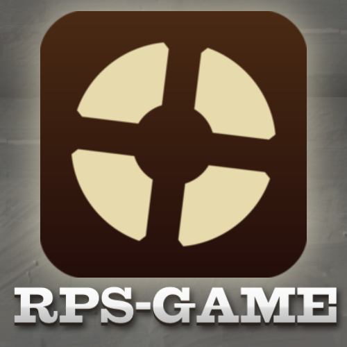

<p align="center">
  
</p>

### 📝 Overview

**RPS-Game** (Rock, Paper, Scissors) is an interactive web application where you can play the classic game against a bot.

---

### ⚡ Quick Installation

#### Prerequisites

- **Node.js** (version 18–22) and **npm**

#### Steps

```bash
git clone [https://github.com/maxon-code/rps-game.git](https://github.com/maxon-code/rps-game.git)
cd rps-game
npm install
npm run dev